<div align="center">

# Corpus — team RAG workspaces (Next.js + Postgres/pgvector + open-source models)

**A team knowledge assistant: ask questions about your own documents and get answers with citations.**

[](https://github.com/ankityadav1asia/Corpus/actions/workflows/ci.yml)

[Video](#video-walkthrough) · [Screenshots](#screenshots) · [Features](#features) · [Architecture](#architecture) · [Methods](#methods-and-techniques) · [Tech stack](#tech-stack) · [Quick start](#quick-start) · [Deployment](#deployment)

</div>

<picture>
  <source media="(prefers-color-scheme: dark)" srcset="docs/images/chat-dark.png" />
  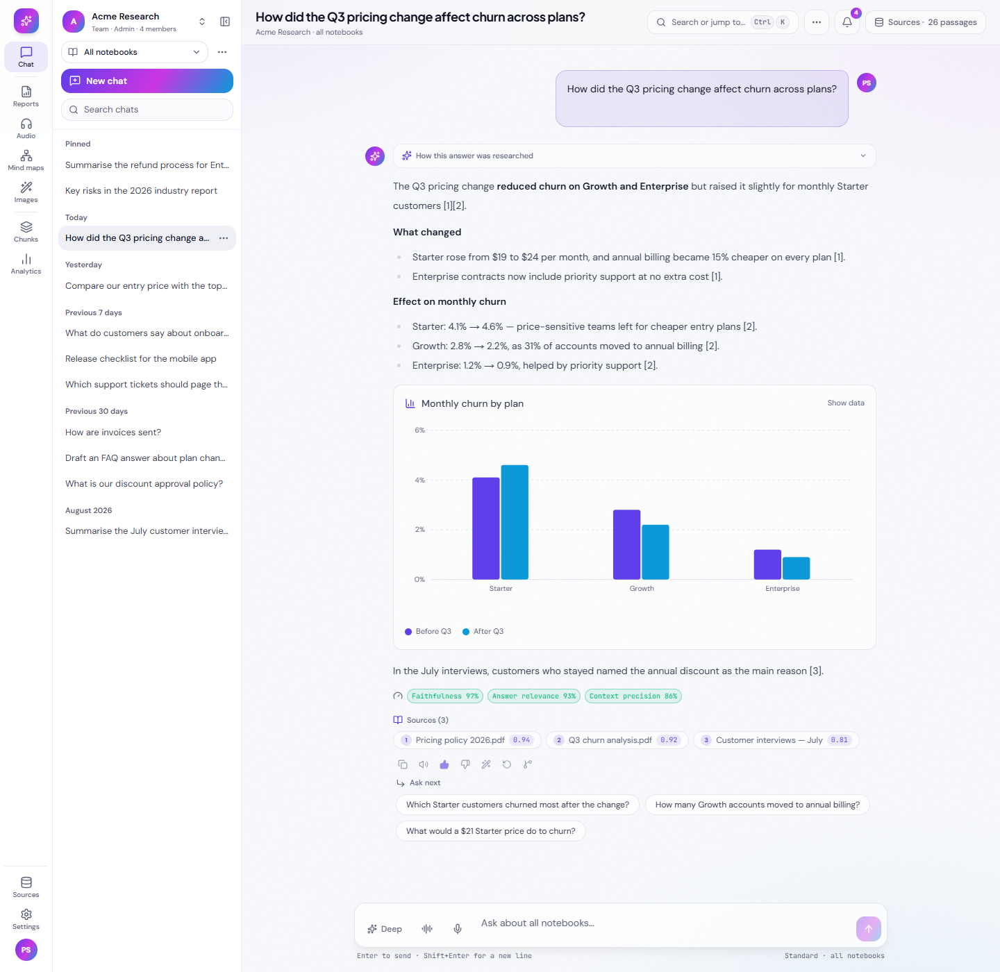
</picture>

Corpus collects files, scanned PDFs, images, recordings, web pages, YouTube videos, notes and whole apps
(Google Drive, Notion, GitHub, websites) into **notebooks**. You ask questions in plain language;
every answer comes only from those sources, with numbered citations you can open. The studio then
turns the same sources into reports, mind maps, audio overviews and images, and a team shares it all
with Admin, Editor and Viewer roles.

## Video walkthrough

<!--
  YouTube: replace YOUR_VIDEO_ID in both places below with the part of your video's URL after
  "watch?v=", remove this comment and the two comment markers around the thumbnail, and delete the
  "coming soon" line.

[](https://www.youtube.com/watch?v=YOUR_VIDEO_ID)
-->

🎬 *A video walkthrough of the project is coming soon.*

## Screenshots

All screenshots show demo data for a fictional company.

| | |
|:---:|:---:|
| 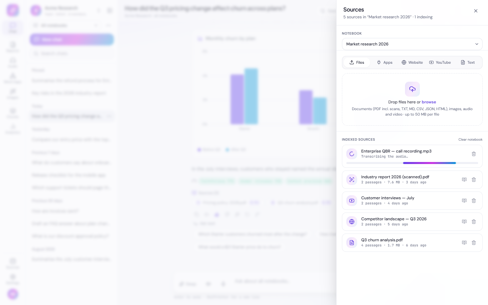 | 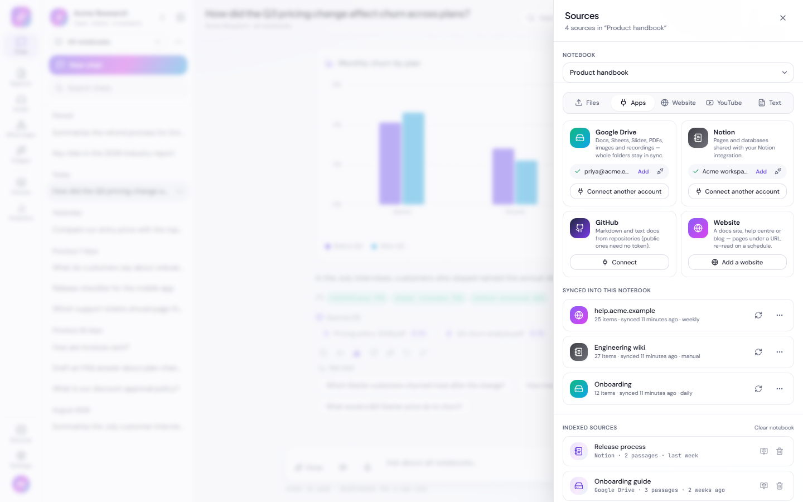 |
| **Sources:** files, scans read with OCR and recordings being transcribed, all indexed in the background | **Connected apps:** Google Drive, Notion, GitHub and websites, kept in sync on a schedule |
| 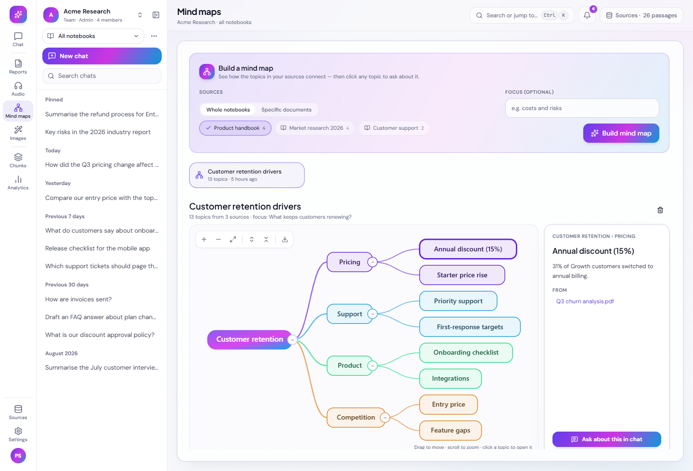 | 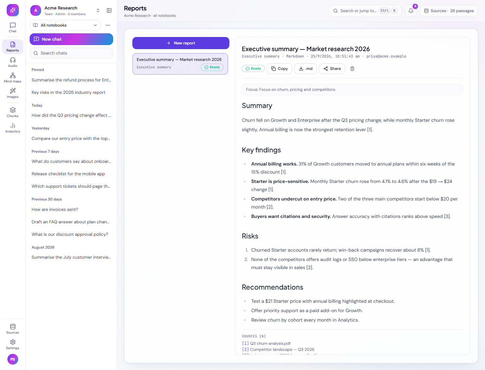 |
| **Mind maps:** a topic tree across your sources; click a topic to see where it comes from or ask about it | **Reports:** executive summaries, comparison tables and slide outlines with sources |
| 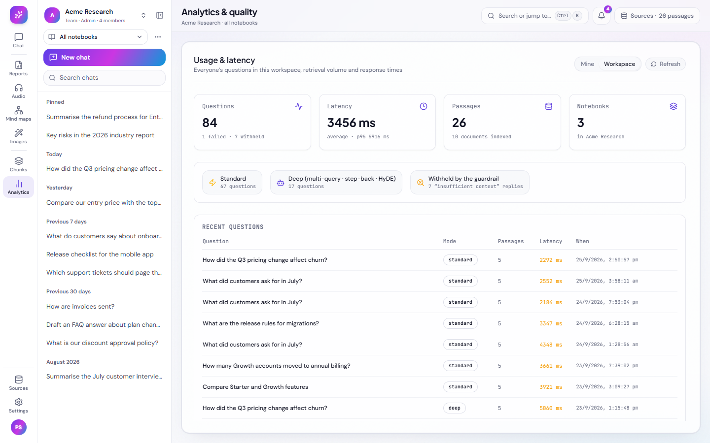 | 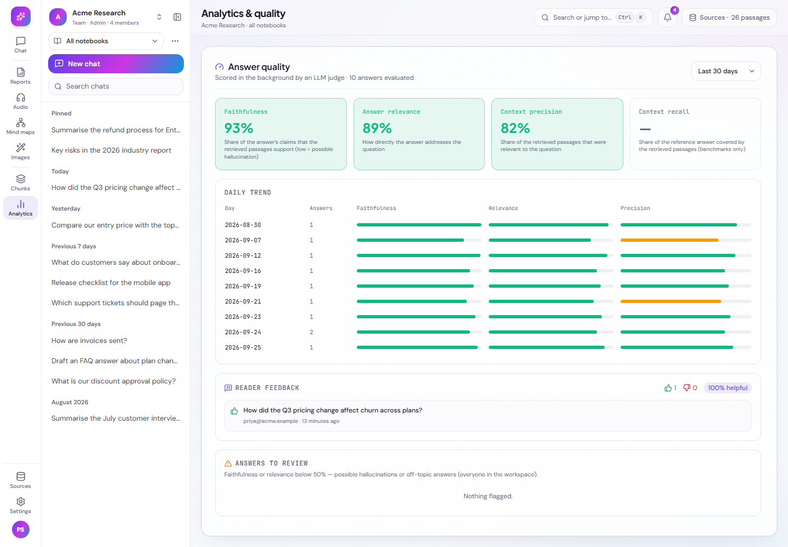 |
| **Analytics:** questions, latency, deep-mode use and questions the guardrail withheld | **Answer quality:** faithfulness, relevance and precision scored by an LLM judge, plus reader feedback |
| 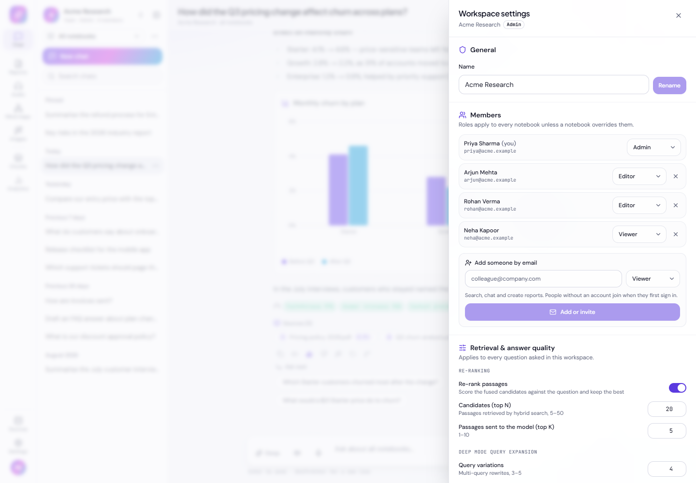 | 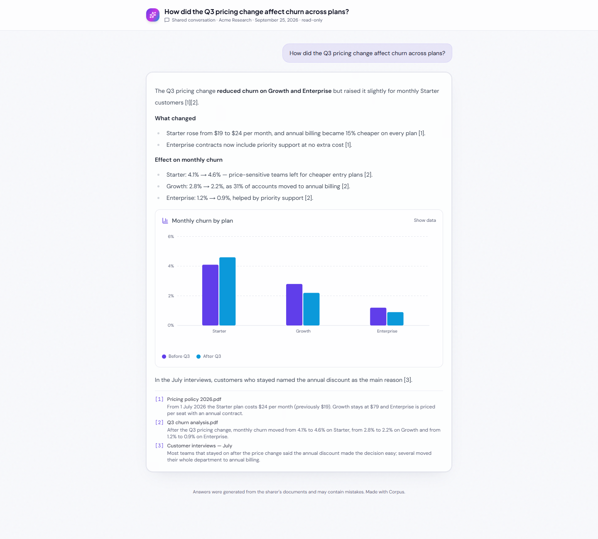 |
| **Workspace settings:** members and roles, retrieval and guardrail knobs, models, chat apps, public links, activity | **Share links:** a read-only snapshot of a chat or report that anyone with the link can open |
| 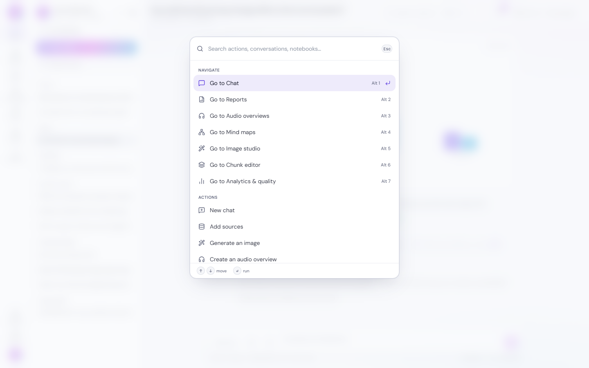 | 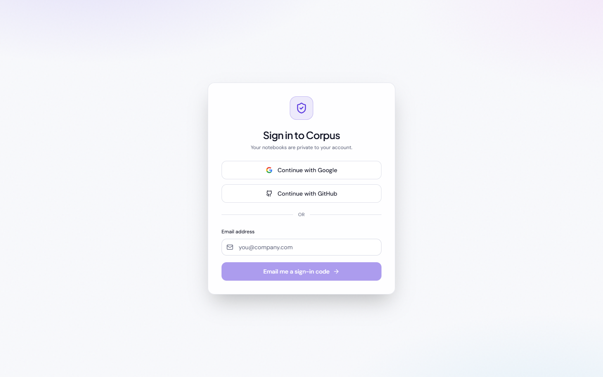 |
| **Command palette:** jump to any view, chat, notebook or action with Ctrl/⌘ K | **Sign in:** Google, GitHub or a one-time email code |

## Features

**Ask and answer**
- Answers only from your sources, with numbered citations that open the passage (and the original PDF at the cited spot, highlighted)
- Deep mode: several rewrites of the question, a broader "step-back" question and a hypothetical answer, searched together
- A relevance guardrail: when nothing relevant is found, the reply is exactly *"Insufficient context in knowledge base."* instead of a guess
- Follow-up question suggestions, inline bar, line and pie charts, voice chat (speak and listen), chat history grouped by date, search, pin, rename, branch, export

**Sources**
- PDF and text formats, images (described by a vision model and read with OCR), scanned PDFs (OCR page by page), audio and video (timestamped transcripts), web pages, YouTube transcripts and notes; up to 50 MB per file (larger files go up in parts)
- Connected apps: Google Drive files and folders, Notion pages and databases, GitHub documentation, whole websites (sitemap or crawl, robots.txt respected), synced on a schedule
- Indexing runs in the background and resumes after interruptions; a chunk editor lets you correct text, labels and metadata

**Studio**
- Reports: executive summary, comparison table or slide outline across notebooks and documents
- Mind maps: an interactive topic tree across your sources
- Audio overviews: two-host conversations in 16 languages (including Hindi and Hinglish) with a timed transcript
- Images grounded in your sources (infographics, diagrams, illustrations)

**Teams**
- A private personal workspace for everyone, plus team workspaces with Admin, Editor and Viewer roles and per-notebook overrides
- Email invitations, an activity (audit) log, notifications, read-only share links
- Slack and Microsoft Teams bots that answer from a chosen notebook, with sources

**Quality and operations**
- Every answer scored in the background (faithfulness, answer relevance, context precision); benchmarks with reference answers; thumbs up and down
- Usage and latency analytics per person or workspace
- Gemini by default, or Gemma and any OpenAI-compatible server (Ollama, vLLM, LM Studio, Groq and others) per capability; OCR runs locally with Tesseract

## Architecture

### System overview

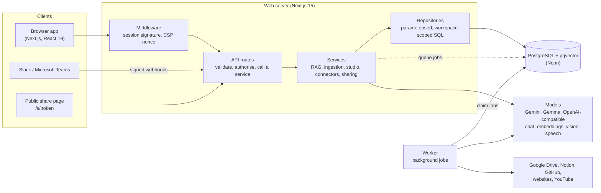
```mermaid
flowchart LR
  subgraph Clients
    B["Browser app<br/>(Next.js, React 19)"]
    CA["Slack / Microsoft Teams"]
    PUB["Public share page<br/>/s/:token"]
  end
  subgraph Web["Web server (Next.js 15)"]
    MW["Middleware<br/>session signature, CSP nonce"]
    RT["API routes<br/>validate, authorise, call a service"]
    SV["Services<br/>RAG, ingestion, studio, connectors, sharing"]
    RP["Repositories<br/>parameterised, workspace-scoped SQL"]
  end
  WK["Worker<br/>background jobs"]
  DB[("PostgreSQL + pgvector<br/>(Neon)")]
  AI["Models<br/>Gemini, Gemma, OpenAI-compatible<br/>chat, embeddings, vision, speech"]
  EXT["Google Drive, Notion, GitHub,<br/>websites, YouTube"]
  B --> MW --> RT --> SV --> RP --> DB
  CA -->|signed webhooks| RT
  PUB --> RT
  SV --> AI
  SV -. queue jobs .-> DB
  WK -->|claim jobs| DB
  WK --> AI
  WK --> EXT
```

### Answering a question

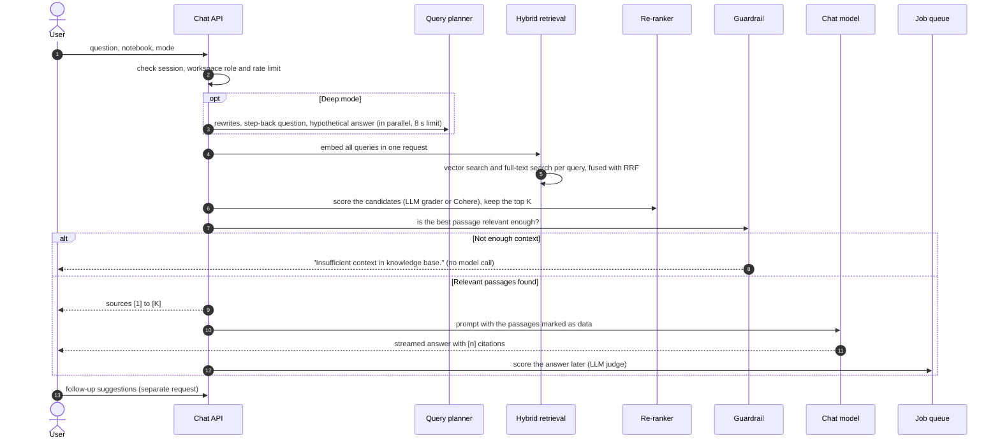
```mermaid
sequenceDiagram
  autonumber
  actor U as User
  participant C as Chat API
  participant Q as Query planner
  participant R as Hybrid retrieval
  participant K as Re-ranker
  participant G as Guardrail
  participant M as Chat model
  participant J as Job queue
  U->>C: question, notebook, mode
  C->>C: check session, workspace role and rate limit
  opt Deep mode
    C->>Q: rewrites, step-back question, hypothetical answer (in parallel, 8 s limit)
  end
  C->>R: embed all queries in one request
  R->>R: vector search and full-text search per query, fused with RRF
  C->>K: score the candidates (LLM grader or Cohere), keep the top K
  C->>G: is the best passage relevant enough?
  alt Not enough context
    G-->>U: "Insufficient context in knowledge base." (no model call)
  else Relevant passages found
    C-->>U: sources [1] to [K]
    C->>M: prompt with the passages marked as data
    M-->>U: streamed answer with [n] citations
    C->>J: score the answer later (LLM judge)
  end
  U->>C: follow-up suggestions (separate request)
```

Progress reaches the browser as a stream of events (`start`, `status`, `sources`, `delta`, `done`), so the
steps show while they run.

### Adding a source

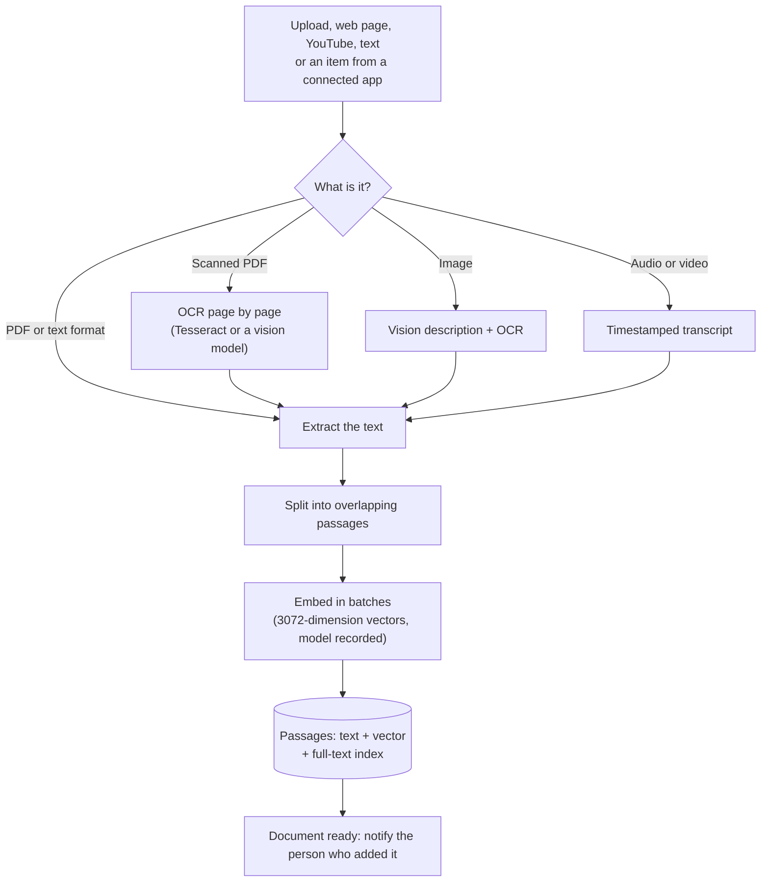
```mermaid
flowchart TD
  IN["Upload, web page, YouTube, text<br/>or an item from a connected app"] --> KIND{"What is it?"}
  KIND -->|"PDF or text format"| TXT["Extract the text"]
  KIND -->|"Scanned PDF"| OCR["OCR page by page<br/>(Tesseract or a vision model)"]
  KIND -->|"Image"| VIS["Vision description + OCR"]
  KIND -->|"Audio or video"| TRN["Timestamped transcript"]
  OCR --> TXT
  VIS --> TXT
  TRN --> TXT
  TXT --> SPL["Split into overlapping passages"]
  SPL --> EMB["Embed in batches<br/>(3072-dimension vectors, model recorded)"]
  EMB --> STORE[("Passages: text + vector<br/>+ full-text index")]
  STORE --> DONE["Document ready: notify the person who added it"]
```

Reading media and indexing are background jobs. Each one saves its progress (pages read, passages
stored), so an interrupted job continues where it stopped.

### Background jobs

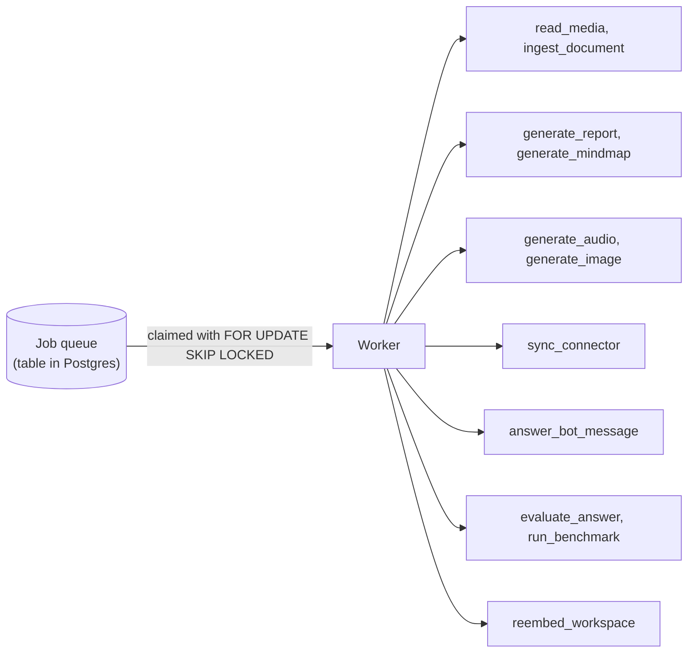
```mermaid
flowchart LR
  Q[("Job queue<br/>(table in Postgres)")] -->|"claimed with FOR UPDATE SKIP LOCKED"| W["Worker"]
  W --> A["read_media, ingest_document"]
  W --> B["generate_report, generate_mindmap"]
  W --> C["generate_audio, generate_image"]
  W --> D["sync_connector"]
  W --> E["answer_bot_message"]
  W --> F["evaluate_answer, run_benchmark"]
  W --> G["reembed_workspace"]
```

- Any number of workers can run, and each job runs once.
- Failures are retried with growing waits; failures a retry cannot fix end the job at once with a
  clear message.
- Long work continues across runs.

### Studio

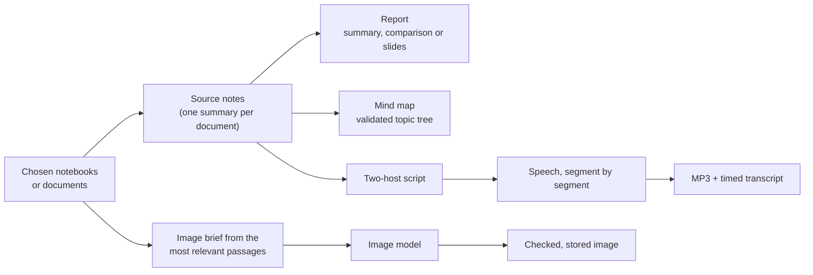
```mermaid
flowchart LR
  SEL["Chosen notebooks<br/>or documents"] --> NOTES["Source notes<br/>(one summary per document)"]
  NOTES --> REP["Report<br/>summary, comparison or slides"]
  NOTES --> MAP["Mind map<br/>validated topic tree"]
  NOTES --> SCRIPT["Two-host script"] --> VOICE["Speech, segment by segment"] --> MP3["MP3 + timed transcript"]
  SEL --> BRIEF["Image brief from the<br/>most relevant passages"] --> IMG["Image model"] --> CHECK["Checked, stored image"]
```

### Connected apps

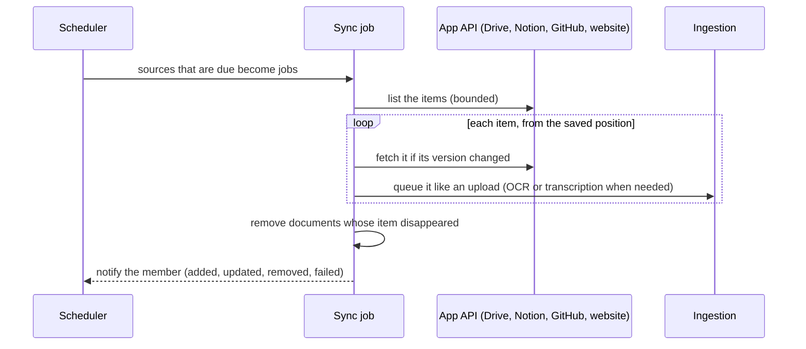
```mermaid
sequenceDiagram
  participant S as Scheduler
  participant J as Sync job
  participant A as App API (Drive, Notion, GitHub, website)
  participant I as Ingestion
  S->>J: sources that are due become jobs
  J->>A: list the items (bounded)
  loop each item, from the saved position
    J->>A: fetch it if its version changed
    J->>I: queue it like an upload (OCR or transcription when needed)
  end
  J->>J: remove documents whose item disappeared
  J-->>S: notify the member (added, updated, removed, failed)
```

A sync runs with the current rights of the member who added the source. Tokens are stored encrypted
and never sent to the browser.

### Sharing and chat apps

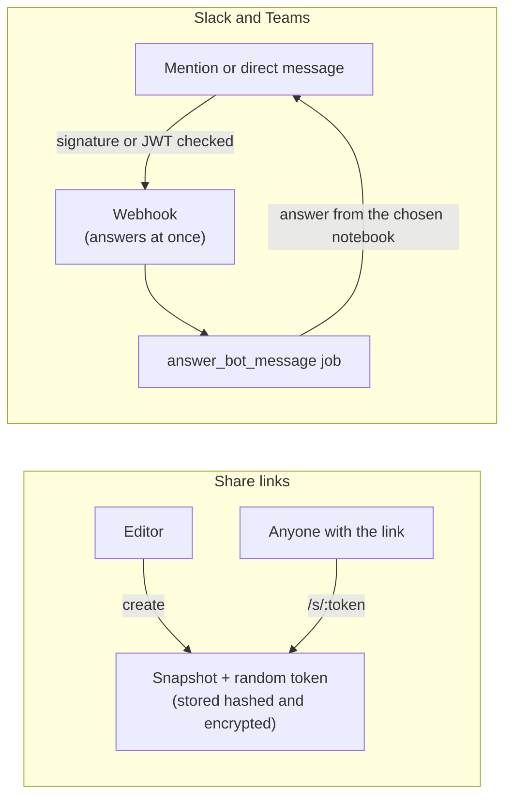
```mermaid
flowchart LR
  subgraph Links["Share links"]
    ED["Editor"] -->|"create"| SNAP["Snapshot + random token<br/>(stored hashed and encrypted)"]
    ANY["Anyone with the link"] -->|"/s/:token"| SNAP
  end
  subgraph Bots["Slack and Teams"]
    ASK["Mention or direct message"] -->|"signature or JWT checked"| HOOK["Webhook<br/>(answers at once)"]
    HOOK --> JOB["answer_bot_message job"]
    JOB -->|"answer from the chosen notebook"| ASK
  end
```

### Sign-in and access control

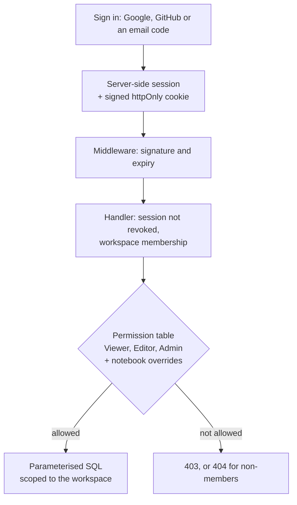
```mermaid
flowchart TD
  IN["Sign in: Google, GitHub or an email code"] --> SES["Server-side session<br/>+ signed httpOnly cookie"]
  SES --> MW["Middleware: signature and expiry"]
  MW --> H["Handler: session not revoked,<br/>workspace membership"]
  H --> P{"Permission table<br/>Viewer, Editor, Admin<br/>+ notebook overrides"}
  P -->|"allowed"| SQL["Parameterised SQL<br/>scoped to the workspace"]
  P -->|"not allowed"| DENY["403, or 404 for non-members"]
```

### Data model

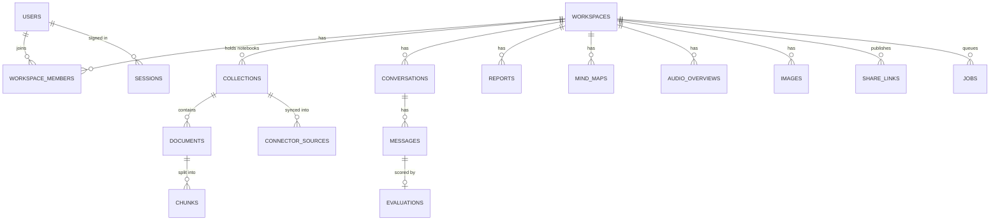
```mermaid
erDiagram
  USERS ||--o{ WORKSPACE_MEMBERS : joins
  WORKSPACES ||--o{ WORKSPACE_MEMBERS : has
  WORKSPACES ||--o{ COLLECTIONS : "holds notebooks"
  COLLECTIONS ||--o{ DOCUMENTS : contains
  DOCUMENTS ||--o{ CHUNKS : "split into"
  WORKSPACES ||--o{ CONVERSATIONS : has
  CONVERSATIONS ||--o{ MESSAGES : has
  MESSAGES ||--o| EVALUATIONS : "scored by"
  WORKSPACES ||--o{ REPORTS : has
  WORKSPACES ||--o{ MIND_MAPS : has
  WORKSPACES ||--o{ AUDIO_OVERVIEWS : has
  WORKSPACES ||--o{ IMAGES : has
  COLLECTIONS ||--o{ CONNECTOR_SOURCES : "synced into"
  USERS ||--o{ SESSIONS : "signed in"
  WORKSPACES ||--o{ SHARE_LINKS : publishes
  WORKSPACES ||--o{ JOBS : queues
```

Each passage (`chunks`) keeps its text, a 3072-dimension vector, the embedding model that produced
it, a full-text index, labels and metadata in one row. Every query is scoped by workspace.

### Deployment

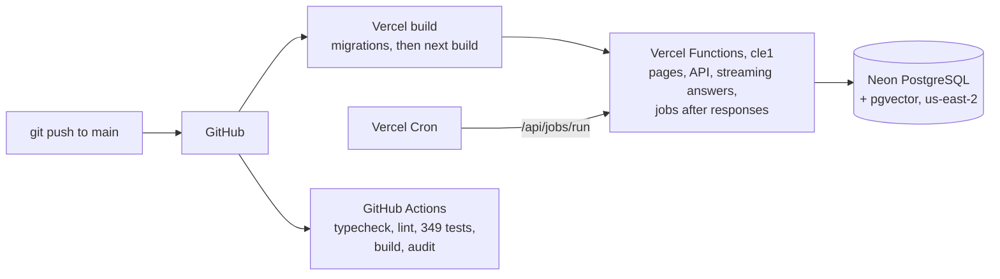
```mermaid
flowchart LR
  PUSH["git push to main"] --> GH["GitHub"]
  GH --> VB["Vercel build<br/>migrations, then next build"]
  VB --> VF["Vercel Functions, cle1<br/>pages, API, streaming answers,<br/>jobs after responses"]
  CRON["Vercel Cron"] -->|"/api/jobs/run"| VF
  GH --> CI["GitHub Actions<br/>typecheck, lint, 349 tests,<br/>build, audit"]
  VF --> NEON[("Neon PostgreSQL<br/>+ pgvector, us-east-2")]
```

More detail: [docs/ARCHITECTURE.md](docs/ARCHITECTURE.md).

## Methods and techniques

### Retrieval-augmented generation

| Technique | What it does | Code |
|---|---|---|
| Hybrid search | Dense vector similarity (pgvector, cosine) combined with PostgreSQL full-text search (`websearch_to_tsquery`) | `server/rag/retrieval.ts` |
| Reciprocal Rank Fusion | Merges the ranked results of every query and both search types into one list | `server/rag/retrieval.ts` |
| Multi-query expansion | Three to five rewrites of the question (deep mode) | `server/rag/query-transform.ts` |
| Step-back prompting | Also searches a broader question about the underlying concept | `server/rag/query-transform.ts` |
| HyDE | Embeds a hypothetical answer to find passages written like answers | `server/rag/query-transform.ts` |
| Re-ranking | An LLM grades the candidates (listwise, 0–10) or Cohere Rerank scores them; the top K reach the model | `server/rag/rerank.ts` |
| Relevance guardrail | No answer, and no model call, when the best passage is below the workspace's threshold | `server/rag/guardrail.ts` |
| Grounded generation | Passages are escaped and wrapped in delimiters as data (prompt-injection defence); answers cite `[n]` | `server/rag/prompt.ts` |
| Streaming | NDJSON events from the server; the answer appears as it is written | `lib/stream-protocol.ts` |
| Fast paths | Helper calls skip the model's thinking phase or use a smaller model; each optional stage has a deadline; repeated questions reuse their embeddings | `server/ai`, `server/rag/query-cache.ts` |
| LLM-as-judge | Faithfulness, answer relevance and context precision for live answers; context recall against reference answers in benchmarks | `server/evaluation` |

### Documents and media

| Technique | Details |
|---|---|
| Text extraction | PDF text layer (pdf-parse), HTML (cheerio), Markdown, CSV, JSON; files identified by their bytes, not their names |
| OCR | Tesseract.js (WebAssembly, English data bundled) page by page, or a vision model for handwriting and complex layouts |
| Transcription | Timestamped transcripts of audio and video (Gemini, or an OpenAI-compatible Whisper server) |
| Chunking | Recursive splitting with overlap |
| Embeddings | `gemini-embedding-001` (3072 dimensions) or any OpenAI-compatible model; the model is stored with each passage, and a workspace can be re-embedded after switching |
| Speech | Gemini text-to-speech (or an OpenAI-compatible server), encoded to MP3 in the app |

### Engineering

| Area | Method |
|---|---|
| Architecture | Layers: route → service → repository; one composition root; interfaces for the database, every model capability, connectors and email |
| Access control | One role-permission table with per-notebook overrides; membership checked on every request; SQL scoped by workspace; another workspace's ids behave like missing ones |
| Security | Server-side revocable sessions; per-request nonce Content-Security-Policy; AES-256-GCM encryption of stored credentials with key rotation; SSRF-safe fetching; rate limits stored in Postgres; signed webhooks; a production configuration check at start |
| Background work | A job queue in Postgres (`FOR UPDATE SKIP LOCKED`), retries with backoff, idempotent and resumable jobs |
| Testing | 349 tests with Node's test runner on PGlite (real PostgreSQL + pgvector in WebAssembly) and fake model providers; no network needed |
| Quality gates | TypeScript strict mode, an ESLint policy (file size, complexity, layering, configuration access), CI on every push, Dependabot |

## Tech stack

| Layer | Technology |
|---|---|
| Frontend | Next.js 15 (App Router), React 19, TypeScript, Tailwind CSS, SWR, react-markdown, pdf.js |
| Backend | Next.js route handlers, zod validation, NDJSON streaming |
| Database | PostgreSQL with pgvector (Neon in production); PGlite for tests and local development |
| AI models | Google Gemini (chat, embeddings, vision, transcription, speech, images), Gemma, OpenAI-compatible servers (Ollama, vLLM, LM Studio, Groq and others), Cohere Rerank |
| Media | Tesseract.js, pdf-parse, cheerio, youtube-transcript, lamejs (MP3) |
| Integrations | Google Drive (OAuth with PKCE), Notion, GitHub, website crawler, Slack Events API, Microsoft Bot Framework |
| Email | Resend or SMTP (nodemailer) for sign-in codes |
| Operations | Vercel (functions, cron), GitHub Actions, Dependabot |
| Testing | node:test, tsx, PGlite, fake model providers |

## Quick start

Requirements: Node.js 20.9+, a Postgres database with the `vector` extension (Neon works out of the
box), and either a Gemini API key or an OpenAI-compatible model server.

```bash
npm install
# create .env with POSTGRES_URL, AUTH_SECRET (openssl rand -hex 32) and GOOGLE_API_KEY (+ APP_URL for production)
npm run db:migrate            # creates or upgrades the app schema; safe to re-run
npm run dev                   # http://localhost:3000
```

Every setting is declared and validated in [server/env.ts](server/env.ts); [Configuration](#configuration) lists the notable ones.

- On Windows PowerShell, if scripts are blocked (`npm.ps1 cannot be loaded`), use `npm.cmd run …`.
- Without an email provider, `npm run dev` prints sign-in codes to the server console.
- To try the app without a database server, set `POSTGRES_URL=pglite:./.data/pglite` (Postgres + pgvector in the Node process, for local development only).

### Running on open-source models

```bash
# Gemma 4 (open weights) through the Gemini API — no other change needed
GEMINI_CHAT_MODEL=gemma-4-26b-a4b-it

# Fully local with Ollama: ollama pull qwen3:8b && ollama pull nomic-embed-text
CHAT_PROVIDER=openai-compatible
EMBEDDING_PROVIDER=openai-compatible
OPENAI_COMPATIBLE_BASE_URL=http://localhost:11434/v1
OPENAI_COMPATIBLE_CHAT_MODEL=qwen3:8b
OPENAI_COMPATIBLE_EMBEDDING_MODEL=nomic-embed-text
```

OCR uses Tesseract on the server by default, with no API calls. Vision, transcription and speech can
also use open-source servers (for example Qwen2.5-VL, faster-whisper or Kokoro); see
[server/env.ts](server/env.ts). Workspace settings → **AI models** shows what each capability uses.
After changing the embedding model, an admin re-embeds the workspace there. Until then, older
passages are found by keyword search only.

### Upgrading an existing database

`npm run db:migrate` applies every pending migration in order (v1 → v15); on Vercel, production
builds run it. Take a backup (a Neon branch) first. From v13 on, sessions live in the database, so everyone signs in again once after
upgrading. Data written by the very first version of the app can be imported with
`npm run db:import-legacy -- --email you@example.com`.

## Deployment

Corpus runs on **Vercel**, with the database on **Neon**. [vercel.json](vercel.json) places the
functions next to the database (`cle1`, AWS us-east-2), migrates the schema during production builds
and schedules the job runner on Vercel Cron. The code works within Vercel's limits:

- files larger than 4 MB are uploaded in parts;
- stored files (PDFs, recordings, images) are streamed back;
- background jobs run after responses and on the cron, and continue where they stopped.

[docs/DEPLOYMENT.md](docs/DEPLOYMENT.md) walks through every step, including the Hobby plan's limits (non-commercial use, one cron run a day). Security operations (secrets, rotation,
the production checklist) are in [docs/SECURITY.md](docs/SECURITY.md).

## Scripts

| Command | What it does |
|---|---|
| `npm run dev` / `build` / `start` | Development server / production build / production server |
| `npm test` | 349 tests (unit, Postgres-in-WebAssembly integration, HTTP routes); no network needed |
| `npm run typecheck` / `lint` | TypeScript, and ESLint with the code standards ([docs/CODE-STANDARDS.md](docs/CODE-STANDARDS.md)); lint fails on any warning |
| `npm run db:migrate` | Apply pending schema migrations |
| `npm run worker` | Process background jobs in a loop; `-- --once` empties the queue once |
| `npm run build:scripts` / `start:worker` | Bundle the worker, migration and re-seal scripts into `dist/scripts` / run the bundled worker (production images) |
| `npm run secrets:reseal` | Re-encrypt stored credentials with a new `AUTH_SECRET` ([docs/SECURITY.md](docs/SECURITY.md)) |
| `npm run db:import-legacy -- --email …` | Import data from the previous version |
| `npm run seed -- --email …` | Add a sample document to that user's personal workspace |

Background jobs also run right after the request that queued them, and while the UI polls for their
results. On Vercel, Vercel Cron calls `/api/jobs/run`; elsewhere, run the worker or schedule
`/api/jobs/run` with `Authorization: Bearer $CRON_SECRET`. Each run also starts scheduled connector syncs.

## Project structure

```
app/            pages and API routes (thin: validate, authorise, call a service)
components/     the UI (workspace shell, sidebar, chat, sources, studio, settings)
hooks/          data hooks (SWR), chat streaming, shared UI state
lib/            code shared by browser and server: API contracts, constants, roles
server/         server-only code: RAG pipeline, ingestion, studio, connectors, jobs,
                repositories (all SQL), security, model adapters
scripts/        migrations, worker, re-sealing, seed, legacy import, the Vercel build
tests/          349 tests on PGlite with fake model providers
docs/           architecture, code standards, deployment, security
```

## API

<details>
<summary>All routes</summary>

All routes except health, sign-in and the cron endpoint require a session cookie, and write requests
must come from the same origin. Workspace-scoped routes need an `X-Workspace-Id` header; non-members
get 404, and missing roles get 403.

| Route | Methods | Purpose |
|---|---|---|
| `/api/auth`, `/api/auth/otp/*`, `/api/auth/oauth/*` | GET, POST, DELETE | Session, email code, Google / GitHub sign-in; `DELETE /api/auth?scope=all` signs out of every device |
| `/api/workspaces`, `/api/workspaces/:id` | GET, POST, PATCH, DELETE | List/create workspaces; rename, retrieval & guardrail settings, delete |
| `/api/workspaces/:id/members`, `…/members/:userId`, `…/invites` | GET, POST, PATCH, DELETE | Members, invitations, roles, leave |
| `/api/workspaces/:id/audit` | GET | Workspace activity log (admins) |
| `/api/workspaces/:id/shares` | GET | Every active public link in the workspace (admins) |
| `/api/workspaces/:id/models`, `…/reembed` | GET, POST | Which model does what; re-embed the workspace with the active embedding model (admins) |
| `/api/chat` | POST | Ask a question; streams NDJSON (`start`, `status`, `sources`, `delta`, `done`, `error`) |
| `/api/collections`, `/api/collections/:id`, `/api/collections/:id/roles` | GET, POST, PATCH, PUT, DELETE | Notebooks and per-notebook role overrides |
| `/api/corpus`, `/api/corpus/documents/:id`, `…/chunks`, `…/retry` | GET, POST, DELETE | Documents (with indexing progress); append a chunk; retry a failed source |
| `/api/corpus/chunks`, `/api/corpus/chunks/:id` | GET, PATCH, DELETE | Chunk editor (filters: notebook, document, label, text) |
| `/api/learn`, `/api/learn/upload`, `/api/learn/url`, `/api/learn/youtube` | POST | Add text, files (documents, images, audio, video, scans), a web page, a YouTube transcript |
| `/api/learn/uploads`, `…/:id/parts/:n`, `…/:id/complete`, `…/:id` | POST, PUT, POST, DELETE | Upload a file larger than 4 MB in parts: start, send each part, complete, or cancel |
| `/api/connectors` | GET | Available apps, your connections and the workspace's synced sources |
| `/api/connectors/connections`, `…/:id`, `…/:id/browse` | POST, DELETE, GET | Connect Notion / GitHub with a token; browse or search an account |
| `/api/connectors/google-drive/start`, `…/callback` | GET | Google Drive OAuth (read-only) |
| `/api/connectors/sources`, `…/:id`, `…/:id/sync` | POST, PATCH, DELETE | Sync items or a website into a notebook; schedule; sync now; remove |
| `/api/audio`, `/api/audio/:id`, `/api/audio/:id/file` | GET, POST, DELETE | Queue (202) and play audio overviews (MP3 with HTTP Range) |
| `/api/mindmaps`, `/api/mindmaps/:id` | GET, POST, DELETE | Queue (202) and read mind maps |
| `/api/reports`, `/api/reports/:id` | GET, POST, DELETE | Queue (202) and read synthesis reports |
| `/api/images`, `/api/images/:id`, `/api/images/:id/file` | GET, POST, DELETE | Queue (202) and read knowledge-grounded images |
| `/api/conversations`, `/api/conversations/:id`, `/api/conversations/:id/branch` | GET, PATCH, DELETE, POST | Private history (`?q=` searches titles and message text), rename, pin, delete, fork |
| `/api/messages/:id/feedback` | PUT | Rate an answer (up, down or cleared) |
| `/api/messages/:id/followups` | POST | Suggested follow-up questions for an answer (generated once, then stored) |
| `/api/shares`, `/api/shares/:id` | GET, POST, DELETE | Read-only public links to a chat or report; revoke |
| `/api/public/shares/:token`, page `/s/:token` | GET | The shared snapshot (no sign-in) |
| `/api/corpus/documents/:id/file` | GET | The original PDF, for the viewer |
| `/api/workspaces/:id/integrations`, `…/:integrationId` | GET, POST, DELETE | Slack / Teams bots (admins) |
| `/api/integrations/slack/:id/events`, `/api/integrations/teams/:id/messages` | POST | Webhooks (Slack signature / Bot Framework JWT) |
| `/api/notifications`, `/api/notifications/read` | GET, POST | In-app notifications |
| `/api/evaluations`, `/api/evaluations/cases`, `/api/evaluations/runs` | GET, POST, DELETE | Quality summary, benchmark questions, benchmark runs (202) |
| `/api/stats`, `/api/analytics` | GET | Schema/feature status and totals; usage and latency (`?scope=workspace` for admins) |
| `/api/jobs/run` | GET, POST | Process queued jobs (Bearer `CRON_SECRET`; 404 when unset) |
| `/api/health` | GET | Public liveness check |

</details>

## Configuration

Every variable is declared and validated in [server/env.ts](server/env.ts). The notable ones:

- **`AUTH_SECRET`** (required, at least 32 characters; there is no default)
  - Signs sessions and derives the key that encrypts connector and chat-app credentials.
  - Rotate it with `AUTH_SECRET_PREVIOUS` and `npm run secrets:reseal` ([docs/SECURITY.md](docs/SECURITY.md)).
- **`APP_URL`** (required in production; on Vercel the production domain is used when it is unset)
  - OAuth redirect URI for sign-in: `<APP_URL>/api/auth/oauth/callback?provider=google|github`.
  - Redirect URI for the Google Drive connector: `<APP_URL>/api/connectors/google-drive/callback`. Also enable the Drive API and the `drive.readonly` scope.
- **Deployment**
  - `TRUST_PROXY` is the number of reverse proxies in front of the app (automatic on Vercel; 1 behind one reverse proxy), so per-IP rate limits see real client addresses.
  - `WEB_RUNS_JOBS=false` when a dedicated worker processes the job queue.
  - A production server or worker refuses to start without `AUTH_SECRET`, a real Postgres `POSTGRES_URL` (not PGlite) and an https `APP_URL`. Missing optional features only produce a warning.
- **Who can sign in:** `AUTH_ALLOWED_EMAILS` / `AUTH_ALLOWED_DOMAINS`. Invitations do not bypass them.
- **Models**
  - Gemini: `GEMINI_*_MODEL`.
  - Open-source: set `CHAT_PROVIDER`, `EMBEDDING_PROVIDER`, `VISION_PROVIDER`, `TRANSCRIPTION_PROVIDER` or `TTS_PROVIDER` to `openai-compatible` and fill in `OPENAI_COMPATIBLE_*`.
  - OCR: `OCR_ENGINE` (`tesseract`, `vision` or `none`) and `OCR_LANGUAGES`.
- **Re-ranking and jobs:** `RERANKER` (`auto`, `llm`, `cohere` or `none`) with `COHERE_API_KEY`. `CRON_SECRET` enables `/api/jobs/run` (Vercel Cron sends it).
- **Per workspace:** retrieval, guardrail and evaluation settings live in Workspace settings in the app.
- **Chat apps**
  - Slack: create an app with the bot scopes `app_mentions:read`, `chat:write` and `im:history`. Connect it in Workspace settings → Chat apps with its bot token and signing secret, then paste the Request URL it shows into Event Subscriptions (`app_mention`, `message.im`).
  - Teams: create an Azure Bot, connect it with its App ID, client secret and tenant, then set the messaging endpoint it shows.
- **Gemini free tier:** quotas are small, and image generation needs billing. A daily-quota error fails jobs quickly with a readable message instead of retrying all day.

## Documentation

- [Architecture](docs/ARCHITECTURE.md): layers, the RAG pipeline, jobs, data model, security model
- [Code standards](docs/CODE-STANDARDS.md): the rules the linter enforces, and why
- [Deployment](docs/DEPLOYMENT.md): Vercel step by step
- [Security](docs/SECURITY.md): secrets, key rotation, sessions, the production checklist
- [Security audit](docs/SECURITY-AUDIT.md): what was wrong with the first version, and how it was fixed

## Author

Built by **Ankit Yadav** ([@ankityadav1asia](https://github.com/ankityadav1asia)).
