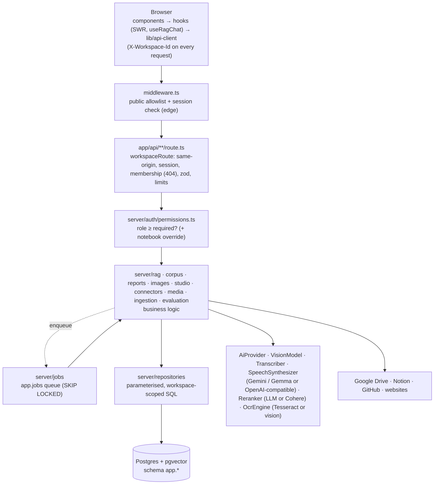
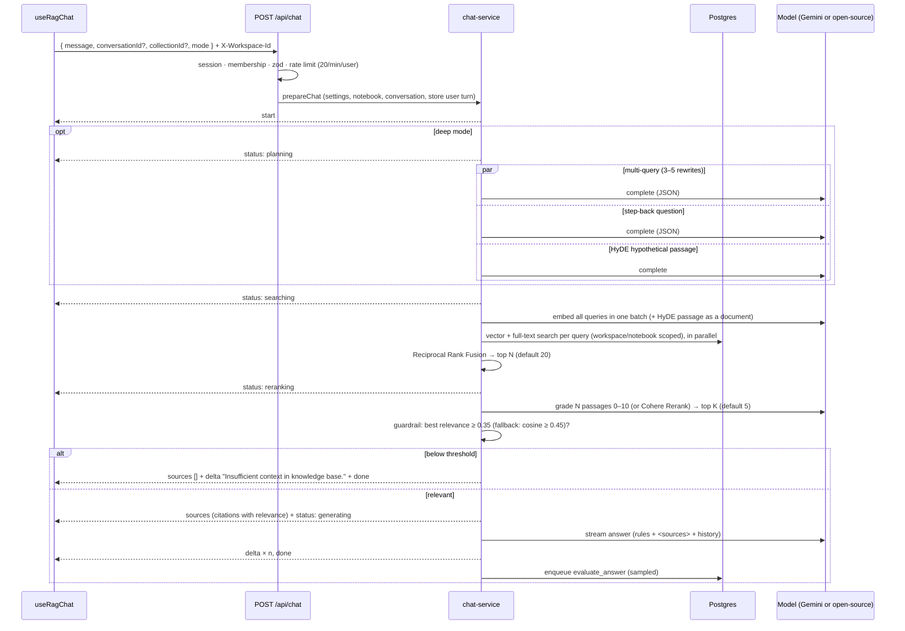
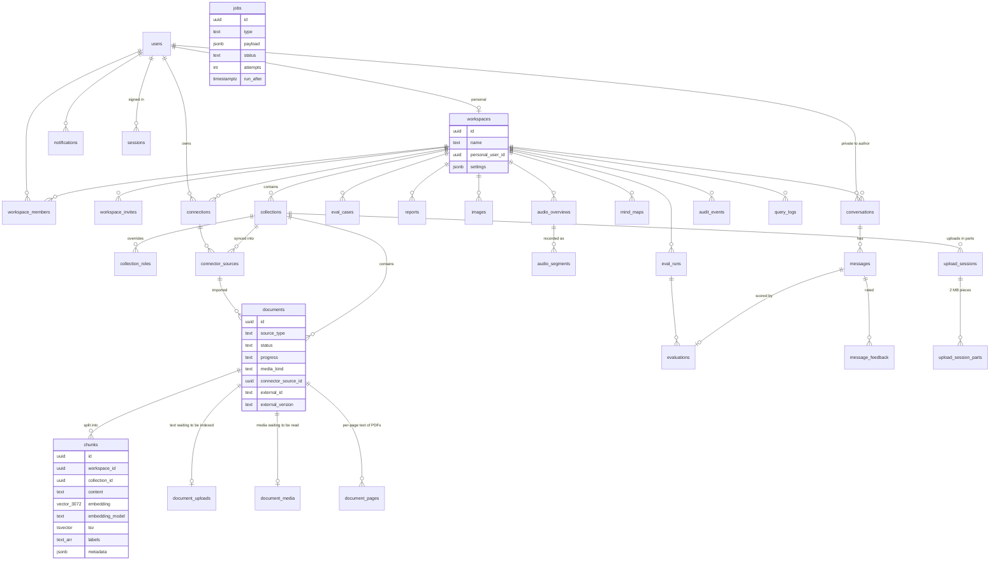

# Architecture

Corpus is a Next.js 15 (App Router) RAG app. People work in **workspaces** (a private personal one,
plus shared team workspaces with Admin / Editor / Viewer roles) that hold **notebooks** of documents
(files, scans, images, recordings, web pages, YouTube transcripts, pasted text, and items synced from
Google Drive, Notion, GitHub or a website). Questions are answered from passages retrieved with hybrid
search (pgvector + Postgres full-text), re-ranked, and checked by a relevance guardrail before any
answer is generated. Answers are scored for quality in the background, and sources can be turned into
reports, images, audio overviews and mind maps. Models are Gemini by default; Gemma or any
OpenAI-compatible server (Ollama, vLLM, …) can take over each capability, and OCR runs locally with
Tesseract.

## Principles

1. **Fail closed.** No default secrets; missing configuration disables features instead of opening them. Non-members get 404 for workspace resources.
2. **Authorisation at the data layer.** Every repository query is scoped by `workspace_id` (and by `owner_id` for private conversations). Route handlers resolve membership and check a named permission; middleware is only a second line.
3. **One way to do each thing.** One DB client, one error model, one request wrapper, one permission table, one streaming protocol, one job queue.
4. **The server owns state.** Chat history, ids and retrieval settings live on the server; the browser sends only the new question.
5. **Everything testable without the cloud.** Services depend on interfaces (`Db`, `AiProvider`, `Reranker`, `VisionModel`, `Transcriber`, `SpeechSynthesizer`, `OcrEngine`, `Connector`, `EmailSender`); tests run the real SQL on PGlite (Postgres + pgvector in WASM) with deterministic fakes.
6. **Graceful degradation.** Every optional AI step (query expansion, re-ranking, evaluation) can fail without failing the question; an unconfigured capability (vision, transcription, speech, a connector) hides its feature instead of breaking others.
7. **Resumable background work.** Anything slow (indexing, OCR, transcription, recording, syncing) stores progress as it goes, so a timed-out or retried job continues instead of starting over.

## Layout

```
app/                        Next.js routes (thin: validate → authorise → call a service)
  page.tsx                  server component: checks the session, renders <Workspace/>
  api/**/route.ts           route handlers, all wrapped by server/http/route.ts
middleware.ts               edge: public allowlist, session signature check, per-request CSP nonce
instrumentation.ts          refuses to start a production server with missing or unsafe configuration
server/                     server-only code (never bundled for the browser)
  env.ts                    zod-validated configuration, model back ends per capability, feature flags
  config-check.ts           startup check of the configuration (errors stop production; warnings are logged)
  services.ts               composition root (DB, repositories, AI, vision, transcriber, speech, OCR, connectors, email)
  http/                     route wrappers (authedRoute, workspaceRoute, workspaceParamRoute, publicRoute), errors, body limits, client IP
  auth/                     sessions (server-side, revocable), OAuth, OTP, allowlist, permissions.ts (RBAC), access.ts
  db/                       Neon + PGlite adapters, versioned migrations, legacy importer
  repositories/             all SQL — parameterised and workspace-scoped (documents, chunks, media, jobs, sessions, …)
  rag/                      splitter, query-transform, retrieval, rerank, guardrail, prompt, chat-service, re-embed
  corpus/                   chunk editor (edit / append / delete with re-embedding)
  evaluation/               LLM-as-judge metrics, live-answer and benchmark scoring
  reports/                  map-reduce synthesis (executive summary, comparison table, slide outline)
  images/                   knowledge-grounded image generation (brief → image model → verified bytes)
  studio/                   audio overviews (script → speech → MP3), mind maps, shared source notes, item routes
  connectors/               Google Drive (+ OAuth), Notion, GitHub, website; the provider-neutral sync engine
  integrations/             Slack and Microsoft Teams bots (webhook verification, replies)
  shares/                   read-only public links (snapshots)
  media/                    reading media before indexing (OCR, vision, transcription), WAV/MP3 encoding
  jobs/                     definitions.ts (one entry per job type), runner, post-response trigger
  ingestion/                extractors (file, URL, YouTube; detects media and scanned PDFs), ingest pipeline
  workspaces/               member management, the overview behind /api/stats
  security/                 key ring, credential sealing and re-sealing, CSP, constant-time compare, SSRF-safe fetcher, rate limiter
  ai/                       AiProvider + media interfaces; Gemini and OpenAI-compatible implementations; JSON reply parsing
  activity.ts               notifications and the workspace audit log (best-effort)
lib/                        isomorphic: API contracts (lib/contracts/*, one file per area), constants, roles, NDJSON protocol, API client
hooks/                      client: SWR data hooks (workspace-keyed), useRagChat, useBusyAction, theme
components/                 UI: workspace/ (shell, header, content, URL state, commands), app-sidebar/ (rail, history,
                            notebook picker), chat, sources drawer, connectors-panel/, studio (reports, images, audio,
                            mind maps), chunk editor, analytics & quality, workspace-settings/, notifications, command palette
scripts/                    init-db (migrate), worker, reseal-secrets, import-legacy, seed; build-scripts bundles the first three;
                            vercel-build (migrations on production builds, then next build)
tests/                      node:test suites (unit, PGlite integration, HTTP route tests)
vercel.json                 Vercel: region cle1 (next to Neon), Fluid compute, build command, daily cron — docs/DEPLOYMENT.md
Dockerfile, render.yaml     container image (web + worker) and a Render Blueprint, for hosting outside Vercel
.github/                    CI (typecheck, lint, tests, build, audit, Docker) and Dependabot
```

## Layers



A workspace-scoped handler:

```ts
export const PATCH = workspaceRoute<{ id: string }>(async ({ req, params, access }) => {
  const id = parseWith(idSchema, params.id)
  const changes = await readJson(req, chunkUpdateSchema, 32 * 1024)
  // updateChunk checks 'collection.editChunks' on the chunk's notebook (Editor, or an override)
  const chunk = await updateChunk({ repos, ai }, access, id, changes)
  return json({ chunk })
})
```

## Workspaces and roles

Every user gets a **personal workspace** (private, cannot be shared or deleted) on first sign-in.
Team workspaces are created by anyone; the creator is Admin. Members are added by email: existing
accounts join immediately, other addresses get an invitation accepted automatically at sign-in (the
sign-in allowlist still applies).

| Permission | Viewer | Editor | Admin |
|---|:-:|:-:|:-:|
| Search & chat, browse notebooks, sources and chunks, view vectors | ✓ | ✓ | ✓ |
| Create reports, images, audio overviews and mind maps (from notebooks they can read) | ✓ | ✓ | ✓ |
| Add sources; edit, add and delete chunks; delete documents | | ✓ | ✓ |
| Connect their own Drive / Notion / GitHub and sync into notebooks they can edit | | ✓ | ✓ |
| Create notebooks; manage benchmark questions and runs | | ✓ | ✓ |
| Rename / clear / delete notebooks; per-notebook access overrides | | | ✓ |
| Members, invitations, retrieval & guardrail settings, re-embed, activity log, delete workspace | | | ✓ |
| Workspace-wide analytics and flagged answers (others see their own) | | | ✓ |

- A **notebook override** replaces a member's workspace role for one notebook (up or down). Workspace admins are always admins of every notebook.
- Conversations stay **private to their author** even inside a shared workspace.
- The last admin can neither leave nor be demoted; the workspace row is locked (`FOR UPDATE`) so two admins demoting each other concurrently cannot both succeed.
- The policy is a single table (`server/auth/permissions.ts`); the UI mirrors it only to hide controls.

## Question answering pipeline



- **Query transformation** (`server/rag/query-transform.ts`): the three strategies run concurrently with `Promise.allSettled`; each can fail independently and the question is still searched as asked. Variants are de-duplicated against the question.
- **Re-ranking** (`server/rag/rerank.ts`): `RERANKER=auto` uses Cohere Rerank v2 when `COHERE_API_KEY` is set, otherwise a Gemini listwise grader (scores 0–10 → 0–1, refuses partial gradings). If it fails, fusion order is used and the step says so.
- **Guardrail** (`server/rag/guardrail.ts`): relevance comes from the re-ranker; cosine similarity is only a fallback, and rank-based RRF scores are never treated as relevance. When the check fails the model is not called, the reply is exactly `Insufficient context in knowledge base.`, and the query is logged as `insufficient_context`. Thresholds are per-workspace settings.
- Every answer carries a human-readable account of these steps (“How this answer was researched”).
- NDJSON events: `start`, `status`, `sources`, `delta`, `done`, `error` — one JSON object per line, so model output can never be mistaken for metadata.

## Background jobs

Heavy work runs outside the request in a durable queue (`app.jobs`):

| Job | Queued by | Does |
|---|---|---|
| `evaluate_answer` | a finished answer (sampled per workspace) | LLM-as-judge scoring of that answer |
| `run_benchmark` | `POST /api/evaluations/runs` | answers every benchmark question through the live pipeline and scores it against its reference; continues in a follow-up job if it runs out of time |
| `generate_report` | `POST /api/reports` (202) | map-reduce synthesis of the selected documents |
| `ingest_document` | every new source (upload, URL, YouTube, text, connector item, finished media) | split → embed → store, in steps; resumes at the first missing chunk |
| `read_media` | uploaded images, audio, video, scanned PDFs | vision / OCR / transcription, page by page for scans, then queues `ingest_document` |
| `generate_image` | `POST /api/images` (202) | image brief from the sources → image model → verified, stored bytes |
| `generate_audio` | `POST /api/audio` (202) | notes → two-host script → speech in segments (MP3) → timed transcript; resumes per segment |
| `generate_mindmap` | `POST /api/mindmaps` (202) | notes → one validated topic tree |
| `sync_connector` | adding a source, “Sync now”, the schedule | list → import new/changed items → prune deleted ones; resumes per item |
| `reembed_workspace` | `POST /api/workspaces/:id/reembed` (admins) | re-embeds passages from another embedding model, in steps |
| `answer_bot_message` | a Slack mention / DM or a Teams message | answers from the integration's notebook and replies in the thread / conversation |

- Each job type is one entry in `server/jobs/definitions.ts`: how to run it, what to show while a retry waits, and how to record a final failure and tell the person who started it. The payload is validated once for all three.
- Claimed with `FOR UPDATE SKIP LOCKED` (any number of workers, each job runs once); a crashed worker's job is reclaimed after 10 minutes. A stopping worker (SIGTERM) finishes its current job and claims no new one.
- Retries back off 10 s → 20 s → 40 s…; when Gemini returns 429 with a `RetryInfo` delay, the job waits at least that long, and the adapter stops burning quota on immediate retries. A **daily** quota error, invalid input or a `PermanentJobError` fails the job at once with a readable message instead of retrying. Waiting items show why (“AI service busy — retrying in ~40s”).
- Jobs return `'more'` when their time budget runs out; a follow-up job continues from the stored progress (chunks, OCR pages, audio segments, sync state).
- Duplicate work is refused while the same job is active (`hasActive`), e.g. a second “Sync now”.
- **Who runs jobs:** after each response that queued work (Next.js `after()`), the endpoints the UI polls while waiting (sources, conversation, reports, images, audio, mind maps, connectors, benchmark runs), `npm run worker` (a polling loop), and `/api/jobs/run` for a scheduler (Bearer `CRON_SECRET`; Vercel Cron calls it, see `vercel.json`). Each pass also queues connector syncs that are due. One runner per server instance at a time. With a dedicated worker, `WEB_RUNS_JOBS=false` keeps OCR, transcription and audio out of the web process.
- A runner claims only the job types its version knows, so during a rollout an older worker leaves new types to newer code.

## Speed

Latency before the first words is what users feel, so the pipeline keeps it short:

- **Thinking off for helper calls.** Re-ranking, deep-mode planning, judging and follow-up suggestions call `ai.complete({ fast: true })`: Gemini 3 models get `thinkingLevel: 'low'`, Gemini 2.x / Gemma `thinkingBudget: 0` (a model that rejects the setting is remembered and asked without it). Measured on gemini-3.6-flash: a helper call took 9.2 s with thinking and 1.9 s without (single samples). Gemma accepts the setting but still thinks.
- **Optional fast model** (`GEMINI_FAST_MODEL` / `OPENAI_COMPATIBLE_FAST_MODEL`) for those helper calls; answers keep the main model.
- **Standard-mode answers** stream with thinking off too; deep mode keeps it (quality over speed).
- **Deadlines**: deep-mode planning and re-ranking may take at most `STAGE_TIMEOUTS_MS` (8 s each). Past that, the question is searched as asked / fusion order is used, and the steps say so.
- **Query embedding cache** (`server/rag/query-cache.ts`): repeated questions (and clicked follow-ups asked again) skip the embedding request (LRU, 1 h, per provider and model).
- **Nothing after the answer blocks it**: follow-up questions are a separate request made once the answer has streamed; evaluation is a background job.

## Evaluation

`server/evaluation/judge.ts` asks the model only to classify; the scores are computed deterministically:

| Metric | Computed as | Available for |
|---|---|---|
| Faithfulness | supported claims ÷ claims in the answer (hallucination detection) | live answers, benchmarks |
| Answer relevance | judge rating 1–5 → (r − 1) ÷ 4 | live answers, benchmarks |
| Context precision | relevant passages ÷ retrieved passages | live answers, benchmarks |
| Context recall | reference statements attributable to the passages ÷ reference statements | benchmarks (needs a reference answer) |

The Analytics & quality tab shows averages, a daily trend, answers to review (faithfulness or
relevance below 50%) and benchmark runs. Each answer in chat shows its scores once they arrive.

## Reports

`server/reports/generate.ts`: **map** — every selected document (up to 12, ≤ 60 000 characters each,
rebuilt from its chunks in order) is condensed into template-specific notes, three in parallel;
**reduce** — the notes are combined by a template prompt into an executive summary, a comparison
table (GFM Markdown) or a slide outline. Slide outlines can be produced as JSON that is validated
with zod (`title`, `subtitle`, 1–20 slides of ≤ 8 bullets and notes) and rendered to Markdown too.
Reports are shared with the workspace; the author or an admin can delete them.

## Studio: images, audio overviews, mind maps

All three are queued (202), run as jobs, are shared with the workspace (the author or an admin
deletes them), keep the sources they were built from, and check `collection.search` on every selected
notebook (`server/studio/selection.ts`; up to 20 notebooks or 12 documents). The map step is shared
(`server/studio/notes.ts`): each document, rebuilt from its chunks (≤ 60 000 characters), is condensed
into notes, three at a time, inside `<document>` delimiters.

- **Images** (`server/images/generate.ts`): passages come from retrieval + the guardrail (or the chosen documents); an “art director” call writes a precise brief (labels, numbers, layout) in one of six styles; the image model draws it; the bytes are verified (type, size, dimensions) and stored with the brief and sources.
- **Audio overviews** (`server/studio/audio.ts`): notes → a two-host script as JSON (`deep_dive`, `brief`, `critique`, `debate`; ~350 / 900 / 1 600 words; 16 languages including Hindi and Hinglish; optional focus) → lines cleaned of citations, URLs and Markdown and split at sentence ends → spoken in segments of ≤ 10 lines / 1 100 characters (Gemini multi-speaker TTS, or one request per line on OpenAI-compatible servers) → each segment encoded to MP3 (64 kbps, lamejs) and stored (`audio_segments`) as soon as it is ready, so a long recording resumes → the transcript is timed from the segment lengths. The file is the segments back to back, served with HTTP Range (`server/http/range.ts`) for seeking; the player highlights the current line and seeks on click.
- **Mind maps** (`server/studio/mindmap.ts`): notes → one JSON topic tree, parsed leniently and trimmed on the server (depth 4, 80 nodes, 8 children, 80-character labels, 280-character summaries). The viewer is an SVG tree with pan / zoom / collapse, PNG and Markdown export, and “Ask about this” that opens chat on the topic.

## Connectors

A connector (`server/connectors/types.ts`) implements `browse`, `list` and `fetchItem`; the sync
engine (`server/connectors/sync.ts`) is the same for every provider:

1. **list** everything in the source (at most 200 items), stored as the sync state;
2. **import** each new or changed item (version compare: Drive `modifiedTime`, Notion `last_edited_time`, GitHub blob sha, website text hash) like an upload — text directly, files through `readUpload`, so scans get OCR and recordings are transcribed; the previous version is replaced only when the new one is ready;
3. **prune** documents whose item disappeared upstream.

Progress is saved after every item, so an interrupted sync resumes. Auto-sync runs every 1–720 hours
(`next_sync_at`, queued by the job runner); a sync sends one notification, not one per file.

| Provider | Connect | Imports |
|---|---|---|
| Google Drive | OAuth (`drive.readonly`, PKCE, signed state cookie, tokens refreshed and re-saved) | files and folders (4 levels, shared drives too): Docs → Markdown, Sheets → CSV, Slides → text, plus any supported file type ≤ 50 MB |
| Notion | integration token (pages must be shared with the integration) | pages and databases (every page in them), as Markdown (a sub-page shows as a heading; add it separately to import its content) |
| GitHub | optional personal access token (public repositories work without one) | documentation files (`.md`, `.mdx`, `.rst`, `.adoc`, `.txt`) of a repository or a path in it |
| Website | nothing | pages under the start URL from its sitemap, or found by following links (same site and folder, 3 levels, up to 100 pages); robots.txt respected; SSRF-safe fetcher |

Connections belong to one member in one workspace; only that member can browse or use them.
Credentials are encrypted with AES-256-GCM using a key derived from `AUTH_SECRET` by HKDF
(`server/security/secrets.ts`); an expired or revoked token marks the connection `error` and asks its
owner to reconnect. Removing a source can keep or delete its documents.

## Answers: follow-ups, charts, PDFs, voice

- **Follow-up questions** (`server/rag/followups.ts`, `POST /api/messages/:id/followups`): three short next questions from the question, answer and source titles (fast helper call, 10 s deadline). Generated once per answer and stored on the message (`messages.followups`), shown as chips under the latest answer; failures return an empty list.
- **Inline charts**: the system prompt lets the model add one ```` ```chart ```` block with `{type: bar|line|pie, title, unit, labels, series}` when it compares three or more numbers from the passages. The JSON is untrusted: `lib/chart.ts` validates and bounds it (24 labels, 6 series, numbers only), and `components/chart-block.tsx` draws SVG (no chart library, theme colours, data table toggle). Invalid charts show as code; streaming ones as a placeholder.
- **PDF viewer**: uploaded (and connector-imported) PDFs are kept in `document_files` (2 MB parts). The source viewer opens the original with pdf.js, finds the cited passage by its letters and digits across the pages' text items (`lib/pdf-match.ts`, robust to spacing and hyphenation), jumps to that page and highlights the items. pdf.js and its worker are served from `public/` (copied from the installed package by `scripts/copy-pdf-worker.mjs`) and loaded outside webpack, whose transform of pdf.js fails at runtime.
- **Voice chat** (`components/voice-mode.tsx`): browser speech recognition (Chrome, Edge, Safari) hears the question, it is sent like a typed one, and the answer is spoken with speech synthesis sentence by sentence while it streams (`lib/speech-text.ts` strips citations, links, Markdown and charts). Tapping interrupts. Languages include English (India) and Hindi.

## Sharing and chat apps

- **Share links** (`server/shares/service.ts`): Editors create a read-only public link to their own chat or to a finished report. The link holds a *snapshot* (later messages stay private; citations lose internal ids and file paths), stops working when revoked (by its creator or an admin) or when the original is deleted, and counts views. Tokens are 192 random bits, stored as a SHA-256 hash for lookup and encrypted to show the link again. The page `/s/:token` is server-rendered, `noindex`, `no-referrer`.
- **Slack** (`server/integrations/slack.ts`): Events API. Every request must carry a valid `X-Slack-Signature` (HMAC-SHA256 with the integration's signing secret, timestamp within 5 minutes). URL verification is answered; @mentions and direct messages are acknowledged at once (Slack's 3 s rule), retries are ignored, and the `answer_bot_message` job posts the answer with numbered sources in the thread.
- **Microsoft Teams** (`server/integrations/teams.ts`): Bot Framework. The request JWT is verified against Microsoft's published keys (RS256, issuer, audience = App ID, expiry, service URL claim, channel endorsement); replies go only to Bot Connector hosts, with a client-credentials token, after a typing indicator.
- Integrations are managed by workspace admins (Workspace settings → Chat apps), answer from one notebook or all, store credentials sealed with the `AUTH_SECRET`-derived key, are rate limited (120 questions / hour each), and use the normal pipeline (retrieval, re-ranking, guardrail).

## Collaboration features

- **Feedback** — readers rate answers up or down (one rating per person per answer); ratings show in Analytics.
- **Notifications** — finished background work (sources ready or failed, reports, images, audio, mind maps, syncs) and being added to a workspace; a bell menu with unread count.
- **Audit log** — member, settings, notebook and content changes per workspace, for admins (`server/activity.ts`; recording is best-effort and never fails the action).
- **Navigation** — a narrow rail holds every view (Chat; studio: reports, audio, mind maps, images; tools: chunk editor, analytics) plus sources, settings and the account menu. Next to it, a collapsible panel is mostly chat history: grouped Pinned / Today / Yesterday / Previous 7 and 30 days / by month (`lib/history.ts`), with a search that runs on the server over titles and message text, so chats older than the 100 listed are found too. On phones both slide in as one drawer.
- Conversations can be pinned, renamed, forked, exported and deleted (sidebar or the chat header menu); deep mode is a toggle in the composer; a command palette (Ctrl/⌘ K) reaches every view and action.

## Chunk editor

Text and vector live in the same row, so an edit updates both together: new text is re-embedded
**before** the row is written (a failed embedding leaves the chunk unchanged), and the full-text
column is generated. Chunks carry `labels` (normalised, GIN-indexed, filterable) and `metadata`
(string/number/boolean values). Editors can also append hand-written chunks to a document. The
explorer shows each vector's dimensions, L2 norm and first values (the full 3 072 numbers never
leave the server).

## Ingestion

`extract → normalise → split (1000 chars / 150 overlap) → embed (batches of 100, retry with backoff) → store`.
The request validates the input, stores the document as `processing` (invisible to search) with its
extracted text, and returns; the `ingest_document` job embeds and stores the chunks in steps and flips
the document to `ready`. The sources drawer shows progress (“Indexing 120 / 480 passages”); a failed
source keeps its error and can be retried. Re-importing the same URL / file / video / connector item
replaces the older copy only once the new one is ready. Limits: 1 M characters and 2 000 chunks per
document, 50 MB per file (the UI uploads files one at a time), 30 ingests / 10 min / user. Only Editors
(of that notebook) can ingest.

Files larger than 4 MB are uploaded **in parts**, because serverless hosts cap request bodies (Vercel at
4.5 MB). `POST /api/learn/uploads` checks the name, size and the caller's rights before any byte is sent;
each `PUT …/parts/:n` stores an exact-size part (in 2 MB pieces, `upload_session_parts`; sending a part
again replaces it); `POST …/complete` checks that every byte arrived, removes the session (so a second
completion finds nothing) and ingests the file exactly like a one-request upload
(`server/ingestion/uploads.ts`). Only the uploader can add to, complete or cancel an upload; at most five
are open per person, and unfinished ones expire after an hour and are purged. Stored files are read back
eight parts per query and streamed to the browser (`server/http/binary.ts`), so neither a database
response nor an HTTP response has to hold a whole 50 MB file.

### Multimodal sources and OCR

`readUpload` (`server/ingestion/extractors.ts`) checks each file by its bytes (magic numbers, not the
extension) and decides:

| Upload | Read by (`read_media` job, `server/media/read-media.ts`) |
|---|---|
| Text formats, PDFs with a text layer | extracted in the request; indexed directly |
| PDFs with scanned pages (text layer < 25 characters on a page) | text pages kept; each scanned page rendered at ~240 dpi and read with OCR, stored per page (`document_pages`), so a 300-page scan continues across job runs |
| Images (PNG, JPEG, WebP) | the vision model transcribes all text and describes the picture (charts, diagrams); OCR when no vision model is configured or it fails |
| Audio (MP3, WAV, M4A, AAC, OGG, FLAC) and video (MP4, MOV, WebM) | transcribed with timestamps (`[mm:ss]`) |

Media bytes wait in `document_media_parts` (2 MB parts, under serverless driver limits) and are dropped
as soon as their text has been read. **OCR** (`server/media/ocr.ts`) is Tesseract via tesseract.js (WebAssembly,
in-process, no API calls; English data is bundled so it works offline) or, with `OCR_ENGINE=vision`,
the vision model. Documents remember their `media_kind`, so citations and the drawer show what they
came from.

## Models

`server/env.ts` resolves a back end for each capability; `server/services.ts` builds them:

| Capability | Gemini (default) | OpenAI-compatible (open source) |
|---|---|---|
| Chat (answers, planning, re-ranking, judging, reports, scripts) | `GEMINI_CHAT_MODEL` — Gemini or open Gemma (`gemma-4-26b-a4b-it`) | `/chat/completions` (Ollama, vLLM, LM Studio, LocalAI, Groq, OpenRouter) |
| Embeddings | `gemini-embedding-001` (3 072 dims) | `/embeddings` (e.g. nomic-embed-text, bge-m3) |
| Vision | chat model | `/chat/completions` with images (e.g. Qwen2.5-VL, Llama 3.2 Vision) |
| Transcription | chat model (a Gemini model when chat is Gemma, which takes no audio) | `/audio/transcriptions` (faster-whisper, whisper.cpp, Groq) |
| Speech | `gemini-2.5-flash-preview-tts`, two voices in one request | `/audio/speech` per line (Kokoro, openedai-speech) |
| OCR | Tesseract (local) or the vision model | same |

Chat and embeddings can come from different providers (`combineProviders`). Reasoning output is
removed from answers (Gemma `thought` parts, `<think>` blocks of Qwen / DeepSeek, also while
streaming). Every chunk stores its `embedding_model`; vector search compares only vectors of the
active model (keyword search still finds the others), vectors shorter than 3 072 dimensions are
zero-padded (cosine similarity is unchanged), and admins can re-embed a workspace (`reembed_workspace`)
after switching. Workspace settings → **AI models** shows the provider and model for each capability,
never keys or URLs.

## Data model



Also `document_media_parts`, `otp_codes`, `rate_limits` and `schema_migrations`. Everything lives in
the `app` schema. Migrations are versioned and append-only (`server/db/migrations.ts`):

| Version | Adds |
|---|---|
| v1 | initial schema |
| v2 | workspaces & roles (moves every user's data into their personal workspace) |
| v3 | chunk labels & metadata |
| v4 | jobs & evaluation |
| v5 | reports |
| v6 | background ingestion (`document_uploads`, progress and error columns) |
| v7 | generated images |
| v8 | answer feedback, notifications, audit log, pinned conversations |
| v9 | `chunks.embedding_model` (existing rows tagged `gemini-embedding-001`), media staging, per-page PDF text, new source types, connector columns on documents |
| v10 | audio overviews (+ segments) and mind maps |
| v11 | connections and connector sources |
| v12 | follow-up questions on messages, share links, original files (PDFs), chat-app integrations |
| v13 | server-side sessions (`app.sessions`): sign-out revokes the token, "sign out of all devices" |
| v14 | chat-app integrations remember whether they answer from all notebooks (`all_notebooks`) |
| v15 | uploads in parts (`upload_sessions`, `upload_session_parts`) |

Search is **exact** (sequential scan filtered by workspace / notebook), correct and fast for corpora
of tens of thousands of chunks. gemini-embedding-001 returns 3 072 dimensions, above pgvector's
2 000-dimension HNSW limit; to scale further add an expression index
`USING hnsw ((embedding::halfvec(3072)) halfvec_cosine_ops)` and order by the same expression.

Workspace settings (`app.workspaces.settings`) are validated with zod on every read, so missing or
invalid values fall back to defaults: re-ranking on, candidate pool 20, top K 5, 4 query variations,
step-back and HyDE on, guardrail on (relevance ≥ 0.35, similarity ≥ 0.45), evaluation of every answer.

## Security model

| Concern | Control |
|---|---|
| Authentication | HMAC-SHA256 session cookie (httpOnly, SameSite=Lax, Secure in prod) naming a server-side session. Middleware checks the signature and expiry; every handler also checks that the session was not revoked (sign-out, "sign out of all devices"; cached ≤ 30 s). No fallback secret. |
| Keys | `AUTH_SECRET` signs sessions and encrypts stored credentials; during a rotation `AUTH_SECRET_PREVIOUS` is still accepted and `npm run secrets:reseal` re-encrypts everything with the new key (docs/DEPLOYMENT.md). |
| Authorisation | Membership resolved per request from `X-Workspace-Id` (non-members: 404); one permission table with notebook overrides; every query scoped by `workspace_id`; conversations also by author. |
| Sign-in | Google (OIDC, `email_verified`), GitHub (verified primary email), email OTP (CSPRNG, HMAC-stored, 5 attempts, single use, one message for every failure, a daily cap per address). Allowlist applies before invitations are accepted. Redirects after sign-in are same-origin paths only. |
| CSRF | SameSite=Lax cookies + `Origin` check on every non-GET request. |
| Browser | Per-request nonce CSP (`script-src 'self' 'nonce-…'`, no inline scripts without it, `frame-ancestors 'none'`), HSTS, nosniff, COOP/CORP same-origin, no framing. |
| Input | zod on every body / query / param (labels, metadata keys, settings ranges, report, benchmark and studio sizes); byte caps before parsing; uploads identified by their bytes, not their name; `websearch_to_tsquery` for user search text. |
| SSRF | Only http(s) on standard ports, DNS answers checked at connect time, redirects re-validated, size and time caps — for URL imports and every website-connector request. Model server URLs come only from server configuration. |
| Share links | Opt-in per chat / report by Editors; snapshot only; unguessable token stored hashed; revocable by the author and by admins (who see every active link); revoked when the author leaves the workspace; dead when the original is deleted; rate-limited per IP; public paths are anchored single-segment patterns. |
| Chat-app webhooks | Slack signatures (HMAC, 5-minute replay window, constant-time compare) and Bot Framework JWTs (RS256 against Microsoft's keys, audience, expiry, service URL) are checked before anything is queued; replies go only to Slack's API and Bot Connector hosts. |
| Connectors | Tokens encrypted at rest (AES-256-GCM, key from `AUTH_SECRET` via HKDF) and never returned to the browser; a connection is usable only by its owner; Drive is read-only with PKCE and a signed, short-lived state cookie bound to the user and workspace; a sync runs with its adder's current rights (Editor on the notebook), and removing a member deletes their connections. |
| Prompt injection | Untrusted text is wrapped and escaped in every prompt (`<source>`, `<passage>`, `<document>`, judge sections); the re-ranker and judge are told passages are data; the renderer never loads images or raw HTML. |
| Background endpoints | `/api/jobs/run` is disabled without `CRON_SECRET` (404) and compares the bearer token in constant time. |
| Abuse / cost | Postgres-backed rate limits (chat, ingest, chunk edits, reports, benchmarks, images, audio, mind maps, connector syncs, feedback, invitations, OTP, shared pages); client IPs only from `TRUST_PROXY` hops of `X-Forwarded-For`; size, page, chunk and item caps; evaluation sampling. |
| Public demo | Opt-in (`DEMO_WORKSPACE_ID`, a team workspace only). Guests are accounts on the reserved `demo.invalid` domain, Viewers of that workspace and held to a read-only policy in `requireWorkspacePermission` / `requireCollectionPermission` (`guestCan`: view and search only); no personal workspace, no workspace creation, no follow-up model calls; starts and questions limited per IP and per day; removed with their chats after 24 hours (`server/auth/demo.ts`). |
| Errors | Unknown errors return a generic 500 with a request id; background job failures are shown as generic messages. |
| Configuration | A production server or worker refuses to start without `AUTH_SECRET`, a real Postgres and an https `APP_URL` (`server/config-check.ts`). |

## Testing

`npm test` runs 335 tests in ~40 s with no network or cloud account (model and app APIs are faked;
OCR tests run real Tesseract on generated scans):

- `tests/authorization.test.ts` — role matrix, notebook overrides, membership (404), `workspaceRoute` middleware
- `tests/query-transform.test.ts` — multi-query / step-back / HyDE parsers, concurrency, failure handling
- `tests/guardrail.test.ts` — thresholds, fallbacks, the re-ranking stage and its fallbacks
- `tests/rerank.test.ts` — LLM grader parsing/ordering, Cohere adapter with a mocked `fetch`
- `tests/quality-units.test.ts` — judge parsing and metrics, slide-outline validation, settings merge, retry policy
- `tests/repositories.test.ts` — every repository on PGlite: workspaces, last-admin race, invites, chunk editing, job queue
- `tests/services.test.ts` — ingestion, chat pipeline and guardrail short-circuit, evaluation, benchmarks, reports, chunk editor permissions
- `tests/http.test.ts` — real route handlers + middleware: auth, CSRF, role matrix, IDOR, workspaces API, reports, cron endpoint
- `tests/migrations.test.ts` — upgrading real v1 data to the latest schema
- `tests/platform.test.ts`, `tests/platform-http.test.ts` — background indexing and retries, image generation, feedback, notifications, audit log, pins
- `tests/images-units.test.ts` — image inspection, brief parsing, Gemini image adapter
- `tests/models-units.test.ts` — OpenAI-compatible chat / embeddings / streaming think-filter, per-capability configuration, multimodal adapters, WAV / MP3, OCR
- `tests/studio.test.ts` — media reading (images, scans page by page, audio), embedding-model tagging and re-embedding, mind maps, audio overviews (resume per segment)
- `tests/connectors.test.ts` — credential encryption, Notion / GitHub / Drive / website adapters with mocked APIs, the sync engine (incremental, prune, resume, schedule)
- `tests/studio-http.test.ts` — media uploads, audio (Range) and mind map routes, models and re-embed, connectors over HTTP, role matrix
- `tests/features-units.test.ts` — thinking-off settings, embedding cache, follow-up parsing, chart validation and scales, speech text, PDF passage matching, Slack signatures / events / mrkdwn, Teams parsing and service URLs, public paths
- `tests/collab-http.test.ts` — fast path in standard and deep mode, follow-ups, share links (snapshot, revoke, delete, roles), original PDFs, Slack and Teams end to end with signed requests and a local RSA key
- `tests/security.test.ts` — session revocation and "sign out of all devices", `AUTH_SECRET` rotation with re-sealing, the CSP nonce, middleware redirects
- `tests/config-check.test.ts` — the production startup check, `TRUST_PROXY` hops, `WEB_RUNS_JOBS`, Vercel's own address as `APP_URL`, the cron warning
- `tests/demo-http.test.ts` — the public demo: team workspace only, guest read-only policy, member list, question limits, purge after a day, public paths
- `tests/uploads-http.test.ts` — uploads in parts: any order and retries, byte-exact reassembly, checks before the first byte, exact part sizes, owner-only access, expiry, the open-upload limit, cancelling
- `tests/session.test.ts`, `tests/ssrf.test.ts`, `tests/units.test.ts`, `tests/auth-and-legacy.test.ts` — session tokens, SSRF, text handling, OTP, legacy import

## Operations

```bash
npm run db:migrate                                   # create/upgrade the app schema (idempotent)
npm run worker                                       # optional: process background jobs continuously
npm run worker -- --once                             # drain the queue once
npm run db:import-legacy -- --email you@example.com  # copy data from the previous version into your personal workspace
npm run seed -- --email you@example.com              # optional sample document
```

Production runs on Vercel (docs/DEPLOYMENT.md): production builds apply the migrations, jobs run after
responses, and Vercel Cron calls `GET /api/jobs/run` with `Authorization: Bearer $CRON_SECRET` so queued
work also progresses when nobody is using the app. Rotating `AUTH_SECRET`: docs/DEPLOYMENT.md.

**Local development without a database server:** `POSTGRES_URL=pglite:./.data/pglite` runs Postgres +
pgvector in-process (the engine the tests use). Run `npm run db:migrate` with the same value first.
One process at a time can open the directory; not for production.

## Known limitations

- Revoking a session takes effect within 30 s on each server instance: handlers cache the check briefly, and middleware checks only the signature.
- Admins add members by email without the member accepting first, and the response tells whether an account exists; an invitation-acceptance flow would close both.
- Uploaded files, media and generated audio/images are stored in Postgres (≤ 50 MB per file, in 2 MB parts). Much larger files would be better uploaded straight to object storage.
- On Vercel's Hobby plan the cron runs once a day: long jobs (big scans, audio overviews) move while someone uses the app, and otherwise wait for the cron or a worker.
- Gemini free-tier quotas are small: re-ranking, evaluation and deep mode each add model calls, and image generation needs billing. Evaluation can be sampled or disabled per workspace, the Cohere re-ranker avoids model calls for re-ranking, and open-source models avoid quotas entirely. Gemma models have their own quota but take no audio input.
- Tesseract OCR is CPU-heavy (a few seconds per page); long scans progress over several job runs. Handwriting is better read with `OCR_ENGINE=vision`.
- A connector sync covers at most 200 items per source (websites: 100 pages); Notion sub-pages must be added separately; GitHub imports documentation files, not code.
- MP3 encoding uses `@breezystack/lamejs` (LGPL-3.0, used unmodified as a library).
- Voice chat depends on the browser's speech recognition (not in Firefox) and voices; audio is processed by the browser vendor's service.
- Bots answer anyone who can message them in the connected Slack / Teams workspace, from the chosen notebook; they do not keep thread history (each question stands alone).

## Code standards

Size, complexity, layering and naming rules are enforced by ESLint (`npm run lint`, zero warnings);
the rules and the reasons behind them are in [CODE-STANDARDS.md](CODE-STANDARDS.md).
